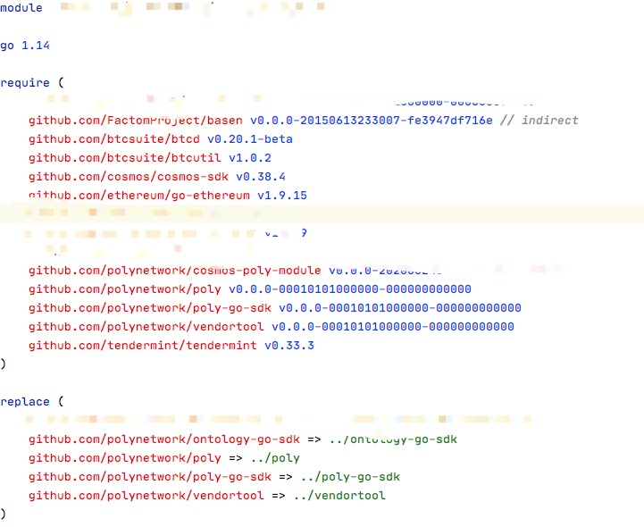

title: Go Mod Intro
speaker: Patrick
<!-- prismTheme: 
plugins:
    - echarts -->

<slide class="bg-black-blue aligncenter" image="https://source.unsplash.com/C1HhAQrbykQ/ .dark">

# Go Mod Intro {.text-landing.text-shadow}

By Patrick {.text-intro}

<slide>
## Go Mod使用

Go Mod 是用来管理GO的第三方依赖，一个项目中往往有很多的第三方依赖，JAVA中使用maven/gradle来管理，Go中就使用Go Mod来管理.

在Go V13版本之后，go mod 默认代开，所以就不行设置

```sh 
export GO111MODULE=on
```

<slide>

## Goland使用Go Mod

创建Go Mod项目/或者选择项目支持Go Mod, 运行go mod init就可以初始化go mod 项目，通过go mod来管理项目的依赖
!

   
<slide>
## go mod的示范文件


<slide>

需要注意三个点:
1. module,这个就是项目的名称
2. require,需要的第三方依赖路径和版本的声明
3. replace,有些第三方依赖是私有仓库保存在本地，就用replace替换在require中的声明，简单说可以理解为把第三方依赖在github.com上的路径替换为本地路径

   
<slide>
## 补充说明

理解了以上几点，基本上可以使用go mod管理仓库了. 需要说明几点:
1. go mod会根据go.mod文件把第三方的代码保存到本地，本地的路径是: $GOPATH/pkg/mod目录相面，GOPATH的设置可以自己设定
2. 如果遇到无法通过远程拿到代码，可以使用replace，把远程代码替换为本地目录里面的代码， 假设无法拿到 github.com/AOrg/ARepo的代码，可以把这些代码复制到本地一个目录，然后使用replace,用本地路径替换github.com/AOrg/ARepo 

