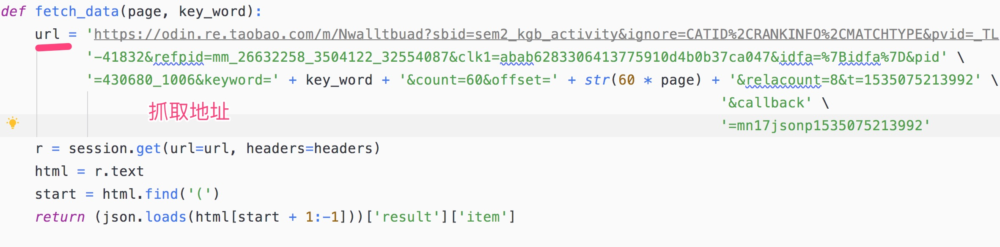
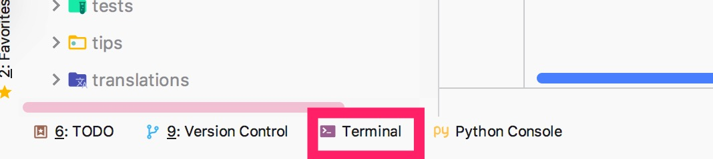

# 环境搭建

- 下载安装[anaconda-windows](https://www.anaconda.com/distribution/#download-section)
如果网速慢可以使用[清华源](https://mirrors.tuna.tsinghua.edu.cn/help/anaconda/)
修改配置

- 配置环境变量(如果需要的化)，打开命令行，输入python或者python3,没有报错就成功了
如果报错了，就把anaconda 安装目录加到windows的环境变量里面
- 下载安装[pycharm community](https://www.jetbrains.com/pycharm/download/)


## pycharm 打开项目

使用pycharm打开文件，看一下pycharm上面提示，选择安装就可以，运行文件就可以抓数据，最后数据保存在当前目录

抓取地址：



## 手动安装依赖(上面没有成功)
打开pycharm的terminal:


运行:
```
pip install requests
pip install openpyxl
```

## 数据处理可以参考

- [datacamp excel](https://www.datacamp.com/community/tutorials/python-excel-tutorial)
- [openpyxl](https://openpyxl.readthedocs.io/en/stable/)
- [openpyxl-说明](https://www.jianshu.com/p/642456aa93e2)
- [fiddle 手机抓包](https://blog.csdn.net/gld824125233/article/details/52588275)

