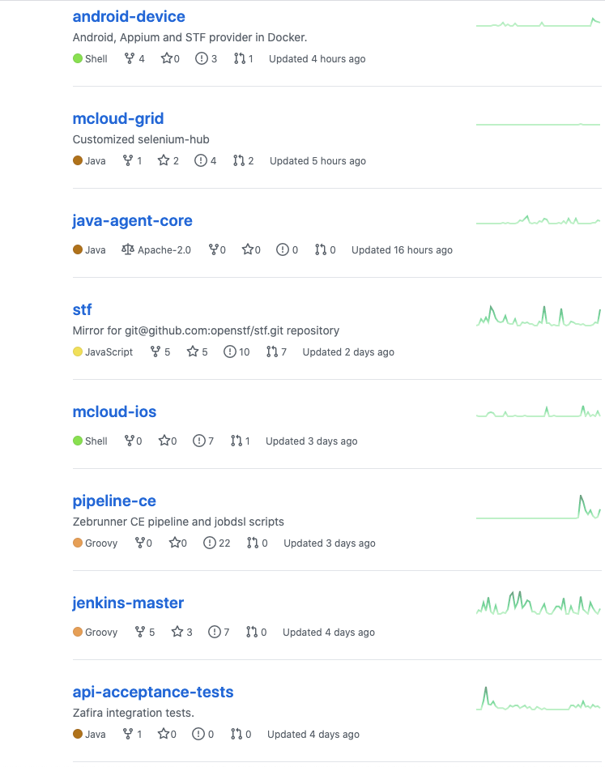
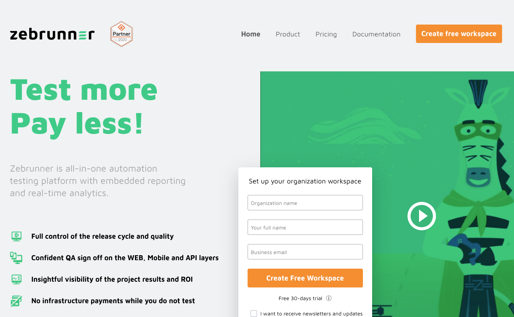
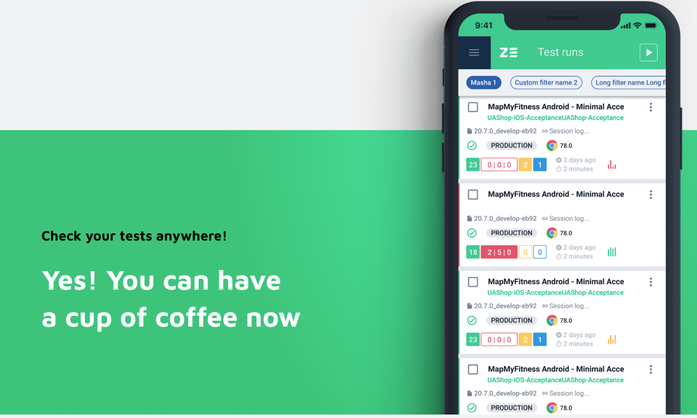

# Zebrunner- a Test Automation Management Tool

```
QA-Daily将每日不定期推送一些测试相关的github仓库,翻译/英文原文文章,
好用的教程给测试/开发人员发现有用的测试工具,了解测试最新动态,
扩大自己的技术视野,从开源项目中获取知识,提高自身能力,
提高自己的Coding技能,提高自己的工资,也能让测试人员职业上又了解更多的选择!
信息不是太少,是太多了,希望QA-Daily能在筛选信息方面帮到想要了解测试/质量相关的工程师.
```

zebrunner是一个Github的自动化测试的配置解决方案，里面包含了从很多有用的组件:

1. Jenkins Master/Slaves Nodes配置
2. Selenium Hub配置
3. STF: Mobile Device Farm 手机管理云工具
4. SonarQube配置
5. 报告Reporting

Zebrunner把所有自动化测试相关的组件整合起来变成自动化测试的基础设施。


看看zebrruner里面的项目,基本上把常见的自动化测试的组件都组合起来了:



## zebrunner websit

我们也可以看看这个仓库背后的公司网站:






对于关心自动化测试的工程师们，这个项目是个学习的好地方，也可以把他的组件抽取出来运用到实际工作中.

最后，这个github的仓库是: https://github.com/zebrunner

如果在使用zebrunner过程中有任何问题，欢迎给留言！

```
QA-Daily 致力于推送一些测试相关的github仓库,翻译/英文原文文章,好用的教程给测试/开发人员！
```

